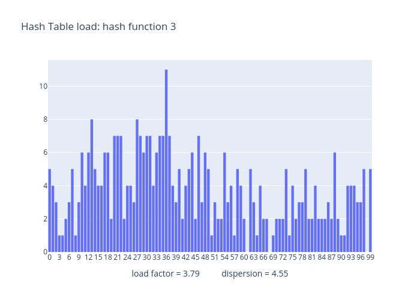

# Stages of program evolution

### Before optimization

  Below is a screenshot of the callgrind results visualized with the help of KCachegrind tool. Functions sorted by the cost of the function itself.
Total instruction fetch cost: 29 541 735.

  

### Vectors optimization

  As we can see one of the most time-consuming function is hash table contain (is_in_list()). So in order to expedite it move the elements of linked lists in __m256i vectors and get the opportunity to use intrinsics.
  Total instruction fetch cost: 9 481 740.
  Optimization efficiency ~ 70%.

  

### ASM implementation optimization

  After first optimization most expensive function if linked list data verificator. Expedite it by rewriting it in ASM.
  Total instruction fetch cost: 9 019 168
  Optimization efficiency ~ 5%.

  
  
# Hash functions evaluation results

  Five hash functions were tested for training purposes:
  1. Constant hash function
  2. First's byte ASCII code function
  3. Length of object function
  4. Sum of ASCII codes of object bytes function
  5. Crc32

  Below are graphs of dependence of linked list loading on its number.

  
  
  
  
  
